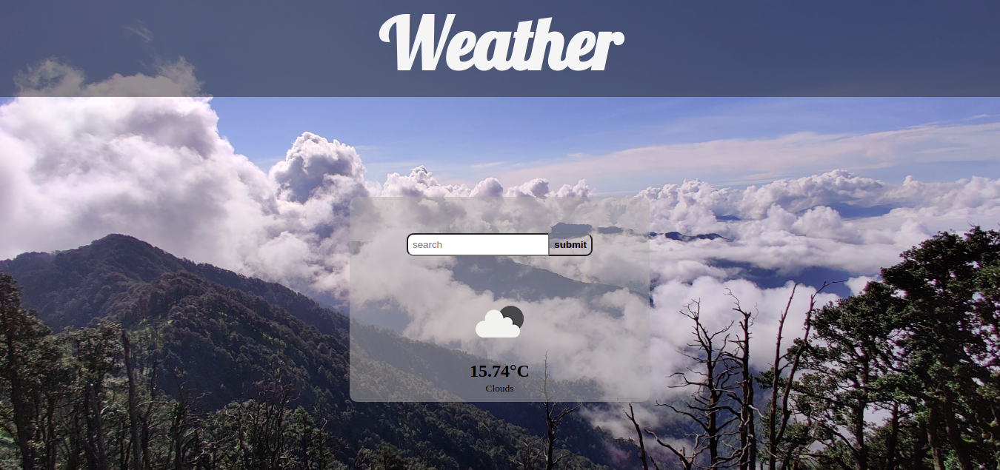

# Weather-app

> I had to build a single-page application for a Weather for learning purposes, for this project I learn about webpacker, Javascript, Javascript DOM, and API data fetching. The project has only one section. This project section is rendered dynamically by DOM manipulation, and the use of modularized code using webpack.

## Built With

- HTML5
- CSS3
- JavaScript
- Webpack
- linters

## Getting Started

To get a local copy up and running follow these simple example steps.

### Setup and Install

- Clone this repository using the following link
  > git clone https://github.com/abdulkhaliqdev/Todo-list.git
- Run `npm install`
- Run `npx webpack --watch`
- Open `dist/index.html` in a live server in your preferred browser to explore the different sections! 

## Authors

👨‍💻 **Abdul Khaliq**

- Github: [@abdulkhaliqdev](https://github.com/abdulkhaliqdev)
- Twitter: [@abdulkhaliqdev](https://twitter.com/Abdulkhaliqdev)
- LinkedIn: [LinkedIn](https://www.linkedin.com/in/abdul-khaliq-89452b1a9/)

## 🤝 Contributing

Contributions, issues and feature requests are welcome!

Feel free to check the [issues page](https://github.com/abdulkhaliqdev/restaurant-page/issues).

## Show your support

Give a ⭐️ if you like this project!

## Acknowledgments

- Microverse
